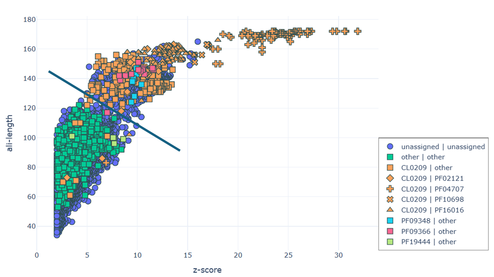
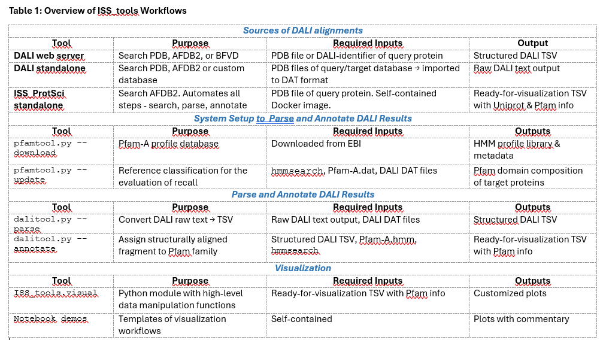

# ISS_tools


**ISS_tools** is a Python package for post-processing and visualization of protein structure alignments generated by DALI. It provides a streamlined workflow for converting, annotating, and analyzing structural similarity results, with a particular focus on integrating Pfam domain information and UniProt metadata. The package is composed of three main components:


### Features
1. **DALI Output Conversion** (```scripts/dalitool.py```)
Converts raw DALI output (from the standalone versions or the DALI web server) into structured TSV format. This standardized output serves as the input for downstream annotation and visualization.
2. **Pfam Assignment** (```scripts/pfamtool.py```)
Assigns Pfam domains to query proteins or aligned segments using profile HMMs via HMMER. Annotations may reflect the full domain architecture (one-to-many) or a simplified one-to-one mapping restricted to the structurally aligned regions.
3. **Visualization Module** (```ISS_tools/visual.py```)
Provides functions for static and interactive plots—including scatter plots, heatmaps, and sequence logos—to support interpretation of annotated structural alignment data. Visualizations are designed to highlight relationships between structure, function, and domain composition.



---

### Installation

1. Running ISS_tools requires the installation of hmmer. Instructions can be found here [HMMER](http://hmmer.org/documentation.html).

2. Install the project python dependencies with
    ```bash
    python -m ensurepip
    python -m pip install --upgrade pip
    pip install .
    ```

    Or for development (with linting):
    ```bash
    pip install -e .[dev]
    ```
   
   Or for visualizations:
   ```bash
   pip install -e .[visualization]
   ```

---

## Usage

1. Examples of DALI output conversion and Pfam assignment can be found in the [tests/README.md](tests/README.md).

2. Templates for visualization workflows can be found in the Jupyter Notebooks (notebooks/demo1.ipynb and notebooks/demo2ipynb).

### Workflow Reference

Below is an overview of the workflows supported by the ISS_tools package:




---

## Development

Ruff and pre-commit are used to keep the code cleaner. Ruff will clean the code while pre-commit will ensure that ruff is run with every git commit command. Pre-commit will reject the commit if ruff finds issues that it cannot fix.

Install ruff and pre-commit with
```bash
pip install -e .[dev]
pre-commit install
```

You can also check (and format) all files with: ```pre-commit run --all-files```


If you want to make a commit without verifying the code, run git commit with the --no-verify flag
```bash
 git commit -m [MESSAGE] --no-verify
```

## Citation

If you use ISS_tools in your work, please cite:

> **ADD PUBLICATION HERE!**
